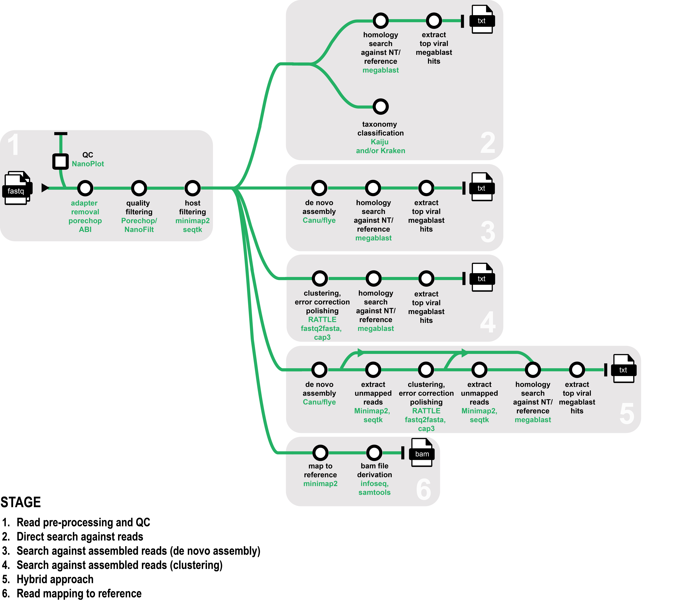

# OViSP (ONT-based Viral Screening for Plant diagnostics)

## Introduction
eresearchqut/OViSP is a Nextflow-based bioinformatics pipeline designed to help phytosanitary diagnostics of viruses and viroid pathogens. It takes fastq files generated from either amplicon or whole-genome sequencing using Oxford Nanopore Technologies as input.

The pipeline can either: 1) perform a direct homology search on the sequenced reads, 2) assemble the reads to generate longer contigs or 3) directly map reads to a known reference. 

The reads can optionally be filtered from a plant host before performing the homology search.

## Pipeline summary
