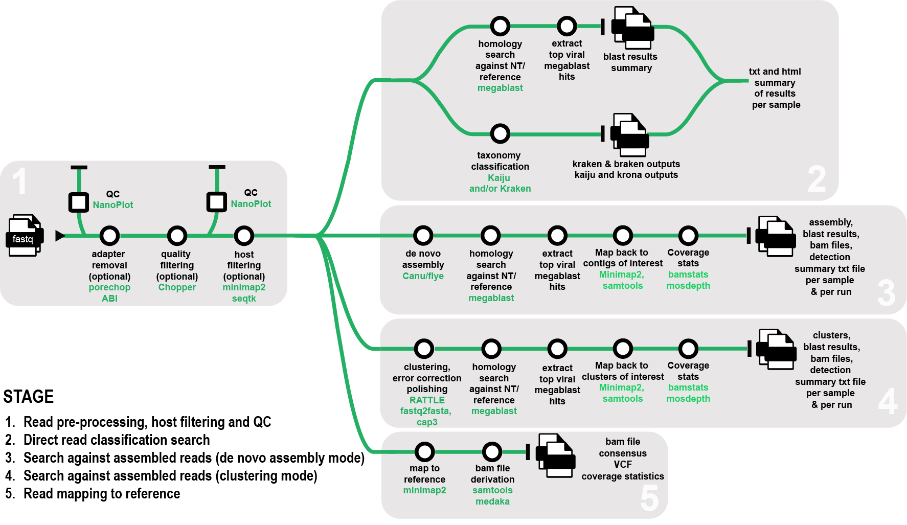
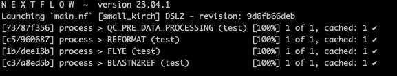
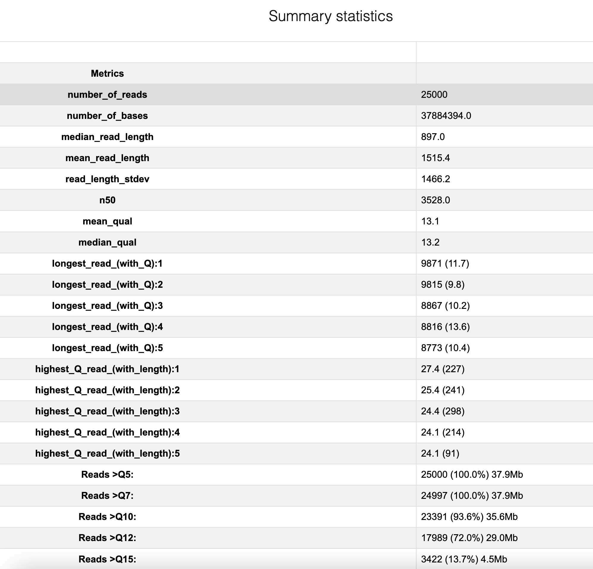
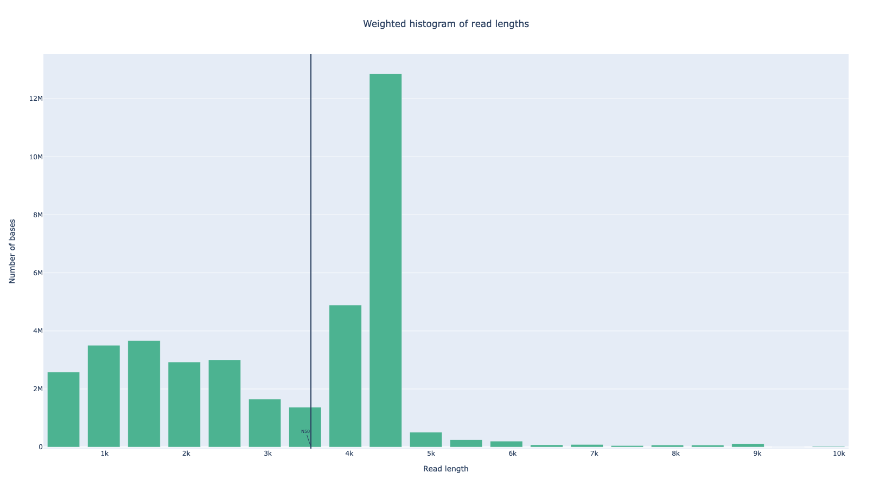
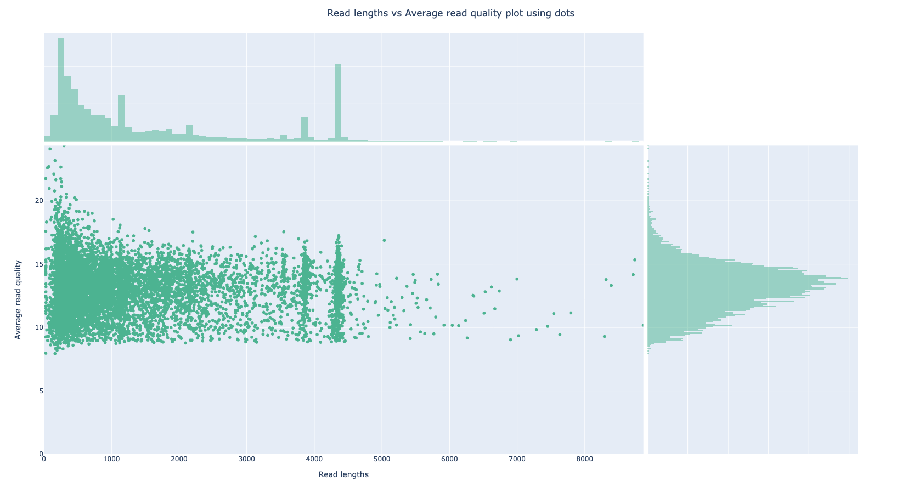

# ONTViSc (ONT-based Viral Screening for Biosecurity)

## Introduction
eresearchqut/ontvisc is a Nextflow-based bioinformatics pipeline designed to help diagnostics of viruses and viroid pathogens for biosecurity. It takes fastq files generated from either amplicon or whole-genome sequencing using Oxford Nanopore Technologies as input.

The pipeline can either: 1) perform a direct search on the sequenced reads, 2) generate clusters, 3) assemble the reads to generate longer contigs or 4) directly map reads to a known reference. 

The reads can optionally be filtered from a plant host before performing downstream analysis.

**Sections:**

1. [Pipeline overview](#pipeline-overview)  
2. [Installation](#installation)  
a. [Requirements](#requirements)  
b. [Installing the required indexes and references](#installing-the-required-indexes-and-references)  
3. [Running the pipeline](#running-the-pipeline)  
a. [Run test data](#run-test-data)  
b. [QC step](#qc-step)  
c. [Preprocessing reads](#preprocessing-reads)  
d. [Host read filtering](#host-read-filtering)  
e. [Read classification analysis mode](#read-classification-analysis-mode)  
f. [De novo assembly analysis mode](#de-novo-assembly-analysis-mode)  
g. [Clustering analysis mode](#clustering-analysis-mode)  
h. [Mapping to reference](#mapping-to-reference)
4. [Output files](#output-files)  
a. [Preprocessing and host read filtering outputs](#Preprocessing-and-host-read-filtering-outputs)  
b. [Read classification mode outputs](#read-classification-mode)  
c. [De novo assembly mode outputs](#de-novo-assembly-mode-outputs)  
d. [Clustering mode outputs](#clustering-mode-outputs)  
e. [Map to reference mode outputs](#map-to-reference-mode-outputs)  
f. [Results folder structure](#results-folder-structure)


5. [Authors](#authors)

## Pipeline overview


- Data quality check (QC) and preprocessing
  - Merge fastq files (Fascat, optional)
  - Raw fastq file QC (Nanoplot)
  - Trim adaptors (PoreChop ABI - optional)
  - Filter reads based on length and/or quality (Chopper - optional)
  - Reformat fastq files so read names are trimmed after the first whitespace (bbmap)
  - Processed fastq file QC (if PoreChop and/or Chopper is run) (Nanoplot)
- Host read filtering
  - Align reads to host reference provided (Minimap2)
  - Extract reads that do not align for downstream analysis (seqtk)
- QC report
  - Derive read counts recovered pre and post data processing and post host filtering
- Read classification analysis mode
- Clustering mode
  - Read clustering (Rattle)
  - Convert fastq to fasta format (seqtk)
  - Cluster scaffolding (Cap3)
  - Megablast homology search against ncbi or custom database (blast)
  - Derive top candidate viral hits
- De novo assembly mode
  - De novo assembly (Canu or Flye)
  - Megablast homology search against ncbi or custom database or reference (blast)
  - Derive top candidate viral hits
- Read classification mode
  - Option 1 Nucleotide-based taxonomic classification of reads (Kraken2, Braken)
  - Option 2 Protein-based taxonomic classification of reads (Kaiju, Krona)
  - Option 3 Convert fastq to fasta format (seqtk) and perform direct homology search using megablast (blast)
- Map to reference mode
  - Align reads to reference fasta file (Minimap2) and derive bam file and alignment statistics (Samtools)

Detailed instructions can be found in [wiki](https://github.com/eresearchqut/ontvisc/wiki).
A step-by-step guide with instructions on how to set up and execute the ONTvisc pipeline on one of the HPC systems: Lyra (Queensland University of Technology), Setonix (Pawsey) and Gadi (National Computational Infrastructure) can be found [here](https://mantczakaus.github.io/ontvisc_guide/).

## Installation
### Requirements  
1. Install Nextflow [`Nextflow`](https://www.nextflow.io/docs/latest/getstarted.html#installation)

2. Install [`Docker`](https://docs.docker.com/get-docker/) or [`Singularity`](https://docs.sylabs.io/guides/3.0/user-guide/quick_start.html#quick-installation-steps) to suit your environment. The pipeline has been validated using singularity version 3.10.2-1 but has not yet been tested with version 4.

### Installing the required indexes and references
Depending on the mode you are interested to run, you will need to install some databases and references.

| Mode | Index | Description |
| --- | --- | --- |
| --host_filtering | --host_fasta | path to host fasta file to use for read filtering|
| --blast_vs_ref | --reference | path to viral reference sequence fasta file to perform homology search on reads (read_classification), clusters (clustering) or contigs (de novo) |
| --blast_mode localdb | --blastn_db | path to [`viral blast database`](https://zenodo.org/records/10117282) to perform homology search on reads (read_classification), clusters (clustering) or contigs (de novo)|
| --blast_mode ncbi | --blastn_db | path to NCBI nt database, taxdb.btd and taxdb.bti to perform homology search on reads (read_classification), clusters (clustering) or contigs (de novo)|
| --read_classification --kraken2 | --krkdb | path to kraken index folder e.g. PlusPFP|
| --read_classification --kaiju | --kaiju_dbname | path to kaiju_db_*.fmi |
|                           | --kaiju_nodes | path to nodes.dmp |
|                           | --kaiju_names | path to names.dmp |
| --map2ref | --reference | path to viral reference sequence fasta file to perform alignment |

- If you have access to a host genome reference or sequences and want to filter your reads against it/them before running your analysis, specify the `--host_filtering` parameter and provide the path to the host fasta file with `--host_fasta /path/to/host/fasta/file`.

- The homology searches is set by default against the public NCBI NT database in the nextflow.config file (`--blast_mode ncbi`)

- If you want to run homology searches against a viral database instead, you will need to download it [`here`](https://zenodo.org/records/10183620) by using the following steps:  
```
wget https://zenodo.org/records/10183620/files/VirDB_20230913.tar.gz?download=1
tar -xf VirDB_20230913.fasta.tar.gz
```
Specify the ``--blast_mode localdb`` parameter and provide the path to the database by specifying ``--blastn_db /path/to/viral/db``.

  Download a local copy of the NCBI NT database, following the detailed steps available at https://www.ncbi.nlm.nih.gov/books/NBK569850/. Create a folder where you will store your NCBI databases. It is good practice to include the date of download. For instance:
  ```
  mkdir blastDB/20230930
  ```
  You will need to use a current update_blastdb.pl script from the blast+  version used with the pipeline (ie 2.13.0).
  For example:
  ```
  perl update_blastdb.pl --decompress nt
  perl update_blastdb.pl taxdb
  tar -xzf taxdb.tar.gz
  ```

  Make sure the taxdb.btd and the taxdb.bti files are present in the same directory as your blast databases.
  Specify the path of your local NCBI blast nt directories in the nextflow.config file.
  For instance:
  ```
  params {
    --blastn_db = '/work/hia_mt18005_db/blastDB/20230930/nt'
  }
  ```
- To run nucleotide taxonomic classification of reads using Kraken2, download the pre-built index relevant to your data and provided by [`Kraken2`](https://benlangmead.github.io/aws-indexes/k2) (for example, PlusPFP can be chosen for searching viruses in plant samples).  

- To run protein taxonomic classification using Kaiju, download the pre-built index relevant to your data. Indexes are listed on the README page of [`Kaiju`](https://github.com/bioinformatics-centre/kaiju) (for example refseq, refseq_nr, refseq_ref, progenomes, viruses, nr, nr_euk or rvdb). After the download is finished, you should have 3 files: kaiju_db_*.fmi, nodes.dmp, and names.dmp, which are all needed to run Kaiju.
You will have to specify the path to each of these files (using the ``--kaiju_dbname``, the ``--kaiju_nodes`` and the ``--kaiju_names`` parameters respectively.

- If you want to align your reads to a reference genome (--map2ref) or blast against a reference (--blast_vs_ref), you will have to specify its path using `--reference`.  


## Running the pipeline  

### Run test data
- Run the command:
  ```
  nextflow run eresearchqut/ontvisc -profile {singularity, docker} --samplesheet index.csv
  ```
  The first time the command runs, it will download the pipeline into your assets.  

  The source code can also be downloaded directly from GitHub using the git command:
  ```
  git clone https://github.com/eresearchqut/ontvisc.git
  ```

- Provide an index.csv file.  
  Create a comma separated file that will be the input for the workflow. By default the pipeline will look for a file called “index.csv” in the base directory but you can specify any file name using the ```--samplesheet [filename]``` in the nextflow run command. This text file requires the following columns (which needs to be included as a header): ```sampleid,sample_files``` 

  **sampleid** will be the sample name that will be given to the files created by the pipeline  
  **sample_path** is the full path to the fastq files that the pipeline requires as starting input  

  This is an example of an index.csv file which specifies the name and path of fastq.gz files for 2 samples. Specify the full path length for samples with a single fastq.gz file. If there are multiple fastq.gz files per sample, place them all in a single folder and the path can be specified on one line using an asterisk:
  ```
  sampleid,sample_files
  MT212,/path_to_fastq_file_folder/*fastq.gz
  MT213,/path_to_fastq_file_folder/*fastq.gz
  ```

- Specify a profile:
  ```
  nextflow run eresearchqut/ontvisc -profile {singularity, docker} --samplesheet index_example.csv
  ```
  setting the profile parameter to one of ```docker``` or ```singularity``` to suit your environment.
  
- Specify one analysis mode: ```--analysis_mode {read classification, clustering, assembly, map2ref}``` (see below for more details)

- To set additional parameters, you can either include these in your nextflow run command:
  ```
  nextflow run eresearchqut/ontvisc -profile {singularity, docker} --samplesheet index_example.csv --adapter_trimming
  ```
  or set them to true in the nextflow.config file.
  ```
  params {
    adapter_trimming = true
  }
  ```

- A test is provided to check if the pipeline was successfully installed. The test.fastq.gz file is derived from of a plant infected with Miscanthus sinensis mosaic virus. To use the test, run the following command, selecting the adequate profile (singularity/docker):
  ```
  nextflow run eresearchqut/ontvisc -profile test,{singularity, docker}
  ```
The test requires 2 cpus at least 16Gb of memory to run and can be executed locally.  


The command should take one minute to run and nextflow should output the following log:
<p align="left"></p>

If the installation is successful, it will generate a results/test folder with the following structure:
```
results/
└── test
    ├── assembly
    │   ├── blast_to_ref
    │   │   └── blastn_reference_vs_flye_assembly.txt
    │   └── flye
    │       ├── test_flye_assembly.fasta
    │       ├── test_flye.fastq
    │       └── test_flye.log
    ├── preprocessing
    │   └── test_preprocessed.fastq.gz
    └── qc
        └── nanoplot
            └── test_raw_NanoPlot-report.html
``` 

### QC step
By default the pipeline will run a quality control check of the raw reads using NanoPlot.

- Run only the quality control step to have a preliminary look at the data before proceeding with downstream analyses by specifying the ```--qc_only``` parameter.

### Preprocessing reads
If multiple fastq files exist for a single sample, they will first need to be merged using the `--merge` option using [`Fascat`](https://github.com/epi2me-labs/fastcat).
Then the read names of the fastq file created will be trimmed after the first whitespace, for compatiblity purposes with all downstream tools.  

Reads can also be optionally trimmed of adapters and/or quality filtered:  
- Search for presence of adapters in sequences reads using [`Porechop ABI`](https://github.com/rrwick/Porechop) by specifying the ``--adapter_trimming`` parameter. Porechop ABI parameters can be specified using ```--porechop_options '{options} '```, making sure you leave a space at the end before the closing quote. Please refer to the Porechop manual.  
To limit the search to known adapters listed in [`adapter.py`](https://github.com/bonsai-team/Porechop_ABI/blob/master/porechop_abi/adapters.py), just specify the ```--adapter_trimming``` option.  
To search ab initio for adapters on top of known adapters, specify ```--adapter_trimming --porechop_options '-abi '```.  
To limit the search to custom adapters, specify ```--adapter_trimming --porechop_custom_primers --porechop_options '-ddb '``` and list the custom adapters in the text file located under bin/adapters.txt following the format:
    ```
     line 1: Adapter name
     line 2: Start adapter sequence
     line 3: End adapter sequence
     --- repeat for each adapter pair---
     ```

- Perform a quality filtering step using [`Chopper`](https://github.com/wdecoster/chopper) by specifying the ```--qual_filt``` parameter. Chopper parameters can be specified using the ```--chopper_options '{options}'```. Please refer to the Chopper manual.  
For instance to filter reads shorter than 1000 bp and longer than 20000 bp, and reads with a minimum Phred average quality score of 10, you would specify: ```--qual_filt --chopper_options '-q 10 -l 1000 --maxlength 20000'```.  

A zipped copy of the resulting preprocessed and/or quality filtered fastq file will be saved in the preprocessing folder.  

If you trim raw read of adapters and/or quality filter the raw reads, an additional quality control step will be performed and a qc report will be generated summarising the read counts recovered before and after preprocessing for all samples listed in the index.csv file.

### Host read filtering
- Reads mapping to a host genome reference or sequences can be filtered out by specifying the ``--host_filtering`` parameter and provide the path to the host fasta file with ``--host_fasta /path/to/host/fasta/file``.

A qc report will be generated in text and html formats summarising the read counts recovered after host filtering.

### Read classification analysis mode
- Perform a direct blast homology search using megablast (``--megablast``).

  Example 1 using a viral database:
  ```
  # Check for presence of adapters.
  # Perform a direct read homology search using megablast against a viral database.

  nextflow run eresearchqut/ontvisc -resume -profile {singularity, docker} \
                              --adapter_trimming \
                              --analysis_mode read_classification \
                              --megablast \
                              --blast_threads 8 \
                              --blast_mode localdb \
                              --blastn_db /path/to/local_blast_db
  ```

  Example 2 using NCBI nt:
  ```
  # Check for presence of adapters .
  # Perform a direct read homology search using megablast and the NCBI NT database. 
  # You will need to download a local copy of the NCBI NT database. 
  # The blast search will be split into several jobs, containing 10,000 reads each, that will run in parallel. 
  # The pipeline will use 8 cpus when running the blast process.

  nextflow run eresearchqut/ontvisc -resume -profile {singularity, docker} \
                              --adapter_trimming \
                              --analysis_mode read_classification \
                              --megablast \
                              --blast_threads 8 \
                              --blast_mode ncbi \ #default
                              --blastn_db /path/to/ncbi_blast_db/nt
  ```

- Perform a direct taxonomic classification of reads using Kraken2 and/or Kaiju.  
  Example:
  ```
  # Check for presence of adapters
  # Perform a direct taxonomic read classification using Kraken2 and Kaiju. 
  # You will need to download Kraken2 index (e.g. PlusPFP) and Kaiju indexes (e.g. kaiju_db_rvdb).

  nextflow run eresearchqut/ontvisc -resume -profile {singularity, docker} \
                              --adapter_trimming \
                              --analysis_mode read_classification \
                              --kraken2 \
                              --krkdb /path/to/kraken2_db \
                              --kaiju \
                              --kaiju_dbname /path/to/kaiju/kaiju.fmi \
                              --kaiju_nodes /path/to/kaiju/nodes.dmp \
                              --kaiju_names /path/to/kaiju/names.dmp
  ```

- Perform direct read homology search using megablast and the NCBI NT database and direct taxonomic read classification using Kraken2 and Kaiju.  
  Example:
  ```
  # Check for presence of adapters
  # Filter reads against reference host
  # Perform a direct read homology search using megablast and the NCBI NT database.
  # Perform a direct taxonomic read classification using Kraken2 and Kaiju.
  nextflow run eresearchqut/ontvisc -resume -profile {singularity, docker} \
                              --adapter_trimming \
                              --host_filtering \
                              --host_fasta /path/to/host/fasta/file \
                              --analysis_mode read_classification \
                              --kraken2 \
                              --krkdb /path/to/kraken2_db \
                              --kaiju \
                              --kaiju_dbname /path/to/kaiju/kaiju.fmi \
                              --kaiju_nodes /path/to/kaiju/nodes.dmp \
                              --kaiju_names /path/to/kaiju/names.dmp \
                              --megablast --blast_mode ncbi \
                              --blast_threads 8 \
                              --blastn_db /path/to/ncbi_blast_db/nt
    ```

### De novo assembly analysis mode  

You can run a de novo assembly using either Flye or Canu. 

If the data analysed was derived using RACE reactions, a final primer check can be performed after the de novo assembly step using the ```--final_primer_check``` option. The pipeline will check for the presence of any residual universal RACE primers at the end of the assembled contigs.

- [`Canu`](https://canu.readthedocs.io/en/latest/index.html) (--canu):

  Canu options can be specified using the `--canu_options` parameter.
  If you do not know the size of your targetted genome, you can ommit the `--canu_genome_size [genome size of target virus]`. However, if your sample is likely to contain a lot of plant RNA/DNA material, we recommend providing an approximate genome size. For instance RNA viruses are on average 10 kb in size (see [`Holmes 2009`](https://www.ncbi.nlm.nih.gov/pmc/articles/PMC2954018/)), which would correspond to `--canu_genome_size 0.01m`.

  By default the pipeline will perform an homology search against the contigs generated using NCBI nt. Alternatively, you can perform an homology search against a viral genome reference (using `--blast_vs_ref`) or a viral database `--blast_mode localdb`.

  Example:
  ```
  # Check for the presence of adapters
  # Perform de novo assembly with Canu
  # Blast the resulting contigs to a reference.
  nextflow run eresearchqut/ontvisc -resume -profile {singularity, docker} \
                              --adapter_trimming \
                              --analysis_mode denovo_assembly --canu \
                              --canu_options 'useGrid=false' \
                              --canu_genome_size 0.01m \
                              --blast_vs_ref  \
                              --reference /path/to/reference/reference.fasta
  ```

- [`Flye`](https://github.com/fenderglass/Flye) (--flye):
  
  The running mode for Flye can be specified using ``--flye_mode '[mode]'``. Since Flye was primarily developed to run on uncorrected reads, the mode is set by default to ``--flye_mode 'nano-raw'`` in the nextflow.config file, for regular ONT reads, pre-Guppy5 (ie <20% error). Alternatively, you can specify the ``nano-corr`` mode for ONT reads that were corrected with other methods (ie <3% error) and the ``nano-hq`` mode for ONT high-quality reads: Guppy5+ SUP or Q20 (ie <5% error).  
  
  If additional flye parameters are required, list them under the ``--flye_options`` parameter. Please refer to the [`Flye manual`](https://github.com/fenderglass/Flye/blob/flye/docs/USAGE.md) for available options.  
  For instance, use ``--genome-size [genome size of target virus]`` to specify the estimated genome size (e.g. 0.01m), ``--meta`` for metagenome samples with uneven coverage, ``--min-overlap`` to specify a minimum overlap between reads (automatically derived by default).  

  Example:
  ```
  # Perform de novo assembly with Flye
  # Blast the resulting contigs to a reference.
  nextflow run eresearchqut/ontvisc -resume -profile {singularity, docker} \
                              --analysis_mode denovo_assembly --flye \
                              --flye_options '--genome-size 0.01m --meta' \
                              --flye_mode 'nano-raw' \
                              --blast_threads 8 \
                              --blastn_db /path/to/ncbi_blast_db/nt
  ```

### Clustering analysis mode
In the clustering mode, the tool [`RATTLE`](https://github.com/comprna/RATTLE#Description-of-clustering-parameters) will be run and the clusters obtained will be further collapsed using CAP3. 
For RATTLE, use the parameter ```--rattle_clustering_options '--raw'``` to use all the reads without any length filtering during the RATTLE clustering step if your amplicon is known to be shorter than 150 bp.

When the amplicon is of known size, we recommend setting up the parameters ```--lower-length [number]``` (by default: 150) and ```--upper-length [number]``` (by default: 100,000) to filter out reads shorter and longer than the expected size.

Set the parameter ```--rattle_clustering_options '--rna'``` and ```--rattle_polishing_options '--rna'``` if the data is direct RNA (disables checking both strands).

Example in which all reads will be retained during the clustering step:
```
nextflow run eresearchqut/ontvisc -resume -profile {singularity, docker} \
                            --analysis_mode clustering \
                            --rattle_clustering_options '--raw' \
                            --blast_threads 8 \
                            --blastn_db /path/to/ncbi_blast_db/nt
```

Example in which reads are first quality filtered using the tool chopper (only reads with a Phread average quality score above 10 are retained). Then for the clustering step, only reads ranging between 500 and 2000 bp will be retained:
```
nextflow run eresearchqut/ontvisc -resume -profile {singularity, docker} \
                            --qual_filt --qual_filt_method chopper --chopper_options '-q 10' \
                            --analysis_mode clustering \
                            --rattle_clustering_options '--lower-length 500 --upper-length 2000' \
                            --blast_threads 8 \
                            --blastn_db /path/to/ncbi_blast_db/nt
```

### Mapping to reference
In the map2ref analysis mode, the reads are mapped to a reference fata file provided using Minimap2. A bam file is created and summary coverage statistics are derived using samtools coverage. A variant call file and a consensus fasta sequence are also generated using [Medaka]`https://github.com/nanoporetech/medaka` and bcftools.  
The ```medaka consensus``` command requires to know the basecaller model version to run properly. Medaka models are named to indicate i) the pore type, ii) the sequencing device (MinION or PromethION), iii) the basecaller variant, and iv) the basecaller version, with the format: ```{pore}_{device}_{caller variant}_{caller version}```. Allowed values can be found by running ```medaka tools list\_models```. Check medaka's github page for more details.  

Recent basecaller versions annotate their output (e.g. fastq files) with their model version; in such cases, medaka is able to determine a correct model by inspecting the BAM input file and no model needs to be specified:

```
nextflow run eresearchqut/ontvisc -resume -profile {singularity, docker} \
                            --merge \
                            --analysis_mode map2ref \
                            --reference /path/to/reference.fasta
```

For older basecallers or if the name of the basecaller model used is known, but has been lost from the input files, the basecaller model will need to be provided to medaka directly. It must however be appended with either ```:consensus``` or ```:variant``` according to whether the user wish to use the consensus or variant calling medaka model. You can specify the medaka model, by using the option ```--medaka_consensus_options  '--model [model number]:[variant/consensus]'```.  

Example of command which specifies a basecaller model version:
```
nextflow run eresearchqut/ontvisc -resume -profile {singularity, docker} \
                            --merge \
                            --analysis_mode map2ref \
                            --reference /path/to/reference.fasta \
                            --medaka_consensus_options '--model dna_r10.4.1_e8.2_400bps_hac@v4.1.0:variant'
```

The minimum coverage for a variant not be flagged 'LOW_DEPTH' in the final VCF by bcl2fastq is specified using the parameter ```--bcftools_min_coverage [number]``. It is set to 20 by default.  


## Output files

### Preprocessing and host read filtering outputs
If a merge step is required, fastcat will create a summary text file showing the read length distribution.  
Quality check will be performed on the raw fastq file using [NanoPlot](https://github.com/wdecoster/NanoPlot) which it a tool that can be used to produce general quality metrics e.g. quality score distribution, read lengths and other general stats. A NanoPlot-report.html file will be saved under the **SampleName/qc/nanoplot** folder with the prefix **raw**. This report displays 6 plots as well as a table of summary statistics.  

<p align="center"></p>

Example of output plots:
<p align="center"></p>
<p align="center"></p>

A preprocessed fastq file will be saved in the **SampleName/preprocessing** output directory which will minimally have its read names trimmed after the first whitespace, for compatiblity purposes with all downstream tools. This fastq file might be additionally trimmed of adapters and/or filtered based on quality and length (if PoreChopABI and/or Chopper were run).  

After quality/length trimming, a PoreChopABI log will be saved under the **SampleName/preprocessing/porechop** folder.  

After adapter trimming, a Chopper log file will be saved under the **SampleName/preprocessing/chopper** folder.  

If adapter trimming and/or quality/length trimming is performed, a second quality check will be performed on the processsed fastq file and a NanoPlot-report.html file will be saved under the **SampleName/qc/nanoplot** folder with the prefix **filtered**.

If host filtering of reads is performed, an unaligned.fastq.gz file and an unaligned_reads_count.txt file listing the remainder read count will be saved under the **SampleName/preprocessing/host_filtering** folder.

If the adapter trimming, the quality filtering and/or the host filtering options have been run, a QC report will be saved both in text and html format (i.e. **run_qc_report_YYYYMMDD-HHMMSS.txt** and **run_qc_report_YYYYMMDD-HHMMSS.html**) under the **qc_report** folder.  

Example of report:

| Sample| raw_reads | quality_filtered_reads | host_filtered_reads | percent_quality_filtered | percent_host_filtered | 
| --- | --- | --- | --- | --- | --- |
| MT010 | 315868 | 315081 | 200632 | 99.75 | 63.52 |

### Read classification mode outputs

#### Nucleotide taxonomic classification (Kraken 2 and Braken)  
After running Kraken2, six files will be saved under the **SampleName/read_classification/kraken** folder. The kraken2 standard output (ie **SampleName.kraken2**) taxonomically classifies each sequence. Check the [manual](https://github.com/DerrickWood/kraken2/blob/master/docs/MANUAL.markdown#output-formats) for details about each table field.

The kraken_report is tab-delimited, with one line per taxon. The fields of the output, from left-to-right, are as follows:  
- Percentage of reads covered by the clade rooted at this taxon  
- Number of reads covered by the clade rooted at this taxon  
- Number of reads assigned directly to this taxon  
- Number of minimizers in read data associated with this taxon  
- An estimate of the number of distinct minimizers in read data associated with this taxon  
- A rank code, indicating (U)nclassified, (D)omain, (K)ingdom, (P)hylum, (C)lass, (O)rder, (F)amily, (G)enus, or (S)pecies.  Taxa that are not at any of these 10 ranks have a rank code that is formed by using the rank code of the closest ancestor rank with a number indicating the distance from that rank. E.g., "G2" is a rank code indicating a taxon is between genus and species and the grandparent taxon is at the genus rank. All other ranks are simply '-'.  
- NCBI taxonomy ID number  
- Indented scientific name  
The scientific names are indented using space, according to the tree structure specified by the taxonomy.  

Unclassified reads are saved in a **SampleName_unclassified.fastq** file.  

The Bracken output file (**SampleName_bracken_report.txt**) is tab delimited and the fields of the output, from left-to-right, are as follows:
- Species name
- Taxonomy ID
- Taxonomy level (S=Species, G=Genus, O=Order, F=Family, P=Phylum, K=Kingdom)
- Number of Kraken Assigned Reads
- Number of Added Reads with Abundance Reestimation
- Total number of Reads after Abundance Reestimation
- Fraction of Total Reads

The **SampleName_bracken_report_viral.txt** will only retain the virus and viroid species from the Bracken output.  
Finally, a filtered output **SampleName_bracken_report_viral_filtered.txt** in which the viral reads for a given detection represent a fraction of at least 0.0001 of the total reads will be retained.  

#### Protein taxonomic classification (Kaiju and Krona)
After running kaiju, six files will be saved under the **SampleName/read_classification/kaiju** folder.  
 The kaiju standard output (ie **SampleName_kaiju_name.tsv**) taxonomically classifies each sequence. The output is tab delimited and the fields of the output, from left-to-right, are as follows:
- either C or U, indicating whether the read is classified or unclassified.
- name of the read
- NCBI taxon identifier of the assigned taxon
- the length or score of the best match used for classification
- the taxon identifiers of all database sequences with the best match
- the accession numbers of all database sequences with the best match
- matching fragment sequence(s)
- Taxon id name

NB: Since the nr database aggregates multiple genes of identical sequences, only the first accession number for each sequence in the nr source file is kept in Kaiju's database and therefore also in the output file.

The number of taxon identifiers (column 5) and accession numbers (column 5) is limited to 20 entries each in order to reduce large outputs produced by highly abundant protein sequences in nr, e.g. from HIV.

A krona output (**SampleName_kaiju.krona**) is also generated.  

The program kaiju2table converts Kaiju's output file(s) into a summary table at the species level. It consists of 4 columns: 
- Sample file name
- percent reads matching this taxon id
- taxon_id
- taxon_name

The **SampleName_kaiju_summary_viral.tsv** only retains viral detections (which are retrieved using a search for the following terms: virus, viroid, viricota, viridae, viriform, virales, virinae, viricetes, virae and viral)
Finally in the filtered output **SampleName_kaiju_summary_viral.tsv**, only detections whose predicted abundance represent a fraction of at least **0.05** of the total reads will be retained.  

#### Nucleotide homology search
If a direct blast homology search of the reads was performed against a database, the results will be saved under the **SampleName/read_classification/homology_search** folder.
All the top hits derived for each contig are listed under the file **SampleName_read_classification_blastn_top_hits.txt**. This file contains the following 26 columns:
```
- qseqid
- sgi
- sacc
- length
- pident
- mismatch
- gapopen
- qstart
- qend
- qlen
- sstart
- send
- slen
- sstrand
- evalue
- bitscore
- qcovhsp
- stitle
- staxids
- qseq
- sseq
- sseqid
- qcovs
- qframe
- sframe
- species
```

Read matches to a virus or viroid as the top blast hit will be listed under the **SampleName_read_classification_blastn_top_viral_hits.txt** file.
If multiple reads are recovered for the same viral species, only the best hit will be listed under **SampleName_assembly_blastn_top_viral_spp_hits.txt**. Selection of the best hit is based on evalue, followed by query length.
The **SampleName_assembly_viral_spp_abundance.txt** here will list the number of reads recovered for each viral species.  
In the example below, 200 reads were recovered matching to the Tomato spotted wilt orthotospovirus:  
```
species	Count
Tomato spotted wilt orthotospovirus	200
```

The **SampleName_assembly_queryid_list_with_viral_match.txt** will list each unique accession IDs detected in the sample, the viral species they correspond to, and the number of reads matching to it, and their ID.  
We can see from the example above, that the reads matching to tomato spotted wilt orthotospovirus correspond to 2 different accession numbers matching to 2 separate segments (L and E) of the virus. there are 2 reads matching to OM112200 and 3 reads matching to OM112202.
```
species	sacc	count	qseqid
Tomato spotted wilt orthotospovirus	OM112200	2	['415df728-dbe8-47a8-afba-e15870adfa5e', 'c443fc2e-6bbe-433d-bfdf-6fa7411ab14f']
Tomato spotted wilt orthotospovirus	OM112202	3	['ee4ccc30-b9fd-4c9b-8b0c-5a37059b539b', '20f389f9-a547-4c43-b0b7-5b0f902b408d', 'ead56ab2-328b-4785-a29a-9ae386ad418b']
```
The **SampleName_blast_report.html** enables the user to have a quick look at the blast results for a sample. It displays:
```
- the total number of matches to viral species
- the total number of matches to viral species (filtered)
- the total number of matches to specific viral accession number
- the top viral match per species based on evalue, followed by qlen
- the top viral match per species based on query length (qlen), followed by evalue
- the top viral match per species based on % identity (pident), followed by qlen
- the top viral match per species based on bitscore, followed by qlen
```

#### Summary
A summary of the results gets output in the **SampleName_read_classification_report.html**. If several modes were tested, they can be found in separate tabs (Megablast, Kraken and/or Kaiju)


### De novo assembly mode outputs
In this mode, the assembly created by Canu will be saved under the **SampleName/assembly/canu** folder.
In the contig headers, the length of each contig and the number of reads that contributed to it are specified.

The canu log is also saved under the same folder.

A log example of a successful Canu assembly is included below:
```
-- Finished on Wed Oct 25 22:37:27 2023 (furiously fast) with 50236.869 GB free disk space
----------------------------------------
-- Finished stage 'generateOutputs', reset canuIteration.
--
-- Assembly 'MT483' finished in 'MT483'.
--
-- Summary saved in 'MT483.report'.
--
-- Sequences saved:
--   Contigs       -> 'MT483.contigs.fasta'
--   Unassembled   -> 'MT483.unassembled.fasta'
--
-- Read layouts saved:
--   Contigs       -> 'MT483.contigs.layout'.
--
-- Bye.
```

Similarly, a fasta file containing the flye assembly and a log of the assembly process will be saved under **SampleName/assembly/flye**
If the Flye assembly ran succesfully it will output some assembly statistics at the end of its log, as per the example below:
```
[2023-10-30 11:56:06] root: INFO: Assembly statistics:

	Total length:	105982
	Fragments:	38
	Fragments N50:	2768
	Largest frg:	4361
	Scaffolds:	3
	Mean coverage:	89
```

If a final primer check was performed, then a **SampleName_assembly_filtered.fa** will be saved under the **SampleName/assembly** folder along with the log of the cutadapt filtering step.


If a blast homology search of the contigs was performed against a database, the results will be saved under the **SampleName/assembly/blastn** folder.
All the top hits derived for each contig are listed under the file **SampleName_assembly_blastn_top_hits.txt**. This file contains the following 26 columns:
```
- qseqid
- sgi
- sacc
- length
- pident
- mismatch
- gapopen
- qstart
- qend
- qlen
- sstart
- send
- slen
- sstrand
- evalue
- bitscore
- qcovhsp
- stitle
- staxids
- qseq
- sseq
- sseqid
- qcovs
- qframe
- sframe
- species
```

For a blast search against NCBI NT, if a contig sequence matches at least 90% of its length to a virus or viroid as the top blast hit, they will be listed under the **SampleName_assembly_blastn_top_viral_hits.txt** file. If the search is against a local viral database, the match has to cover 95% of its length. Coverage is derived using **qcovs**).  
If multiple contigs are recovered for the same viral species, only the best hit will be listed under **SampleName_assembly_blastn_top_viral_spp_hits.txt**. Selection of the best hit is based on e-value followed by length.
The **SampleName_assembly_viral_spp_abundance.txt** here will list the number of contigs recovered for each viral species.  
In the example below, 2 contigs were recovered matching to the Tomato spotted wilt orthotospovirus:  
```
species	Count
Tomato spotted wilt orthotospovirus	2
```
Finally the **SampleName_assembly_queryid_list_with_viral_match.txt** will list each unique accession IDs detected in the sample, the viral species they correspond to, and the number of contigs matching to it, and their IDs.  
We can see from the example above, that the 2 contigs matching to tomato spotted wilt orthotospovirus correspond to 2 different accession numbers matching to 2 separate segments (L and E) of the virus.  
```
species	sacc	count	qseqid
Tomato spotted wilt orthotospovirus	OM112200	1	contig_3
Tomato spotted wilt orthotospovirus	OM112202	1	contig_4
```

### Clustering mode outputs
In this mode, the output from Rattle will be saved under **clustering/rattle/SampleName_transcriptome.fq**. The number of reads contributing to each clusters is listed in the header. The amplicon of interest is usually amongst the most abundant clusters (i.e. the ones represented by the most reads). A fasta file of the clusters created by Rattle will be saved under the **SampleName/clustering/rattle/SampleName_rattle.fasta** file. This will only retain the  names of the clusters. The final cap3-collapsed clusters can be found in the **SampleName/clustering/cap3/SampleName_clustering.fasta** file. If cap3 collapsed clusters, they will be referred as **Contig_number** in the fasta file. Uncollapsed clusters names will remain unaltered (i.e. **cluster_number**).

### Map to reference mode outputs
In this mode, the reads are alighned directly to a reference file to generate an indexed bam file which will be saved under **SampleName/mapping/SampleName_aln.sorted.bam**. A **SampleName/coverage.txt** file is also included which provides a table of coverage as a tabulated text file. Please refer to [Samtools coverage](http://www.htslib.org/doc/samtools-coverage.html) for detailed description. 

The tabulated form uses the following headings:
| headings | description |
| --- | --- |
| rname | Reference name / chromosome matching the headers provided in the fasta file |
| startpos | Start position |
| endpos | End position (or sequence length) |
| numreads | Number reads aligned to the region (after filtering) |
| covbases | Number of covered bases with depth >= 1 |
| coverage | Percentage of covered bases [0..100] |
| meandepth | Mean depth of coverage |
| meanbaseq | Mean baseQ in covered region |
| meanmapq | Mean mapQ of selected reads |

An example of table is included below:

| #rname | startpos | endpos | numreads | covbases | coverage | meandepth | meanbaseq | meanmapq |
| --- | --- | --- | --- | --- | --- | --- | --- | --- |
| AobVX  | 1 | 6803 | 18893 | 6803 | 100 | 4232.75 | 22.3 | 59.1 |


An ASCII-art histogram called **SampleName_histogram** is also available to visualise coverage along the genome. The same statistics reported in the coverage.txt file are found on the right hand side of the histogram.  
An example is provided below:

```
AobVX (6.8Kbp)
>  90.00% |::::::::::::::::::::::::::::::::::::::::::::::::::| Number of reads: 18893
>  80.00% |::::::::::::::::::::::::::::::::::::::::::::::::::|     (7 filtered)
>  70.00% |::::::::::::::::::::::::::::::::::::::::::::::::::| Covered bases:   6.8Kbp
>  60.00% |::::::::::::::::::::::::::::::::::::::::::::::::::| Percent covered: 100%
>  50.00% |::::::::::::::::::::::::::::::::::::::::::::::::::| Mean coverage:   4.23e+03x
>  40.00% |::::::::::::::::::::::::::::::::::::::::::::::::::| Mean baseQ:      22.3
>  30.00% |::::::::::::::::::::::::::::::::::::::::::::::::::| Mean mapQ:       59.1
>  20.00% |::::::::::::::::::::::::::::::::::::::::::::::::::|
>  10.00% |::::::::::::::::::::::::::::::::::::::::::::::::::| Histo bin width: 136bp
>   0.00% |::::::::::::::::::::::::::::::::::::::::::::::::::| Histo max bin:   100%
          1        1.4K      2.7K      4.1K      5.4K       6.8K  
```

A consensus fasta file named ```sample_medaka.consensus.fasta``` will be output incorporating the SNPs observed in the reads that map to the reference.  
All short variants will be summarised in a gzipped VCF called ```sample_medaka.annotated.vcf.gz```. Please refer to the following documentations (http://samtools.github.io/hts-specs/; https://gatk.broadinstitute.org/hc/en-us/articles/360035531692-VCF-Variant-Call-Format) to interpret the VCF format (e.g. structure and the header information). By default variants with a read depth <20 will be flagged as LOW_DEPTH.


Here is an example of a VCF file for a sample called MT483
```
##fileformat=VCFv4.1
##FILTER=<ID=PASS,Description="All filters passed">
##medaka_version=1.11.3
##contig=<ID=AobVX>
##FORMAT=<ID=GT,Number=1,Type=String,Description="Medaka genotype.">
##FORMAT=<ID=GQ,Number=1,Type=Integer,Description="Medaka genotype quality score">
##INFO=<ID=DP,Number=1,Type=Integer,Description="Depth of reads at position, calculated from read pileup, capped to ~8000.">
##INFO=<ID=DPS,Number=2,Type=Integer,Description="Depth of reads at position by strand (fwd, rev), calculated from read pileup, capped to ~8000 total.">
##INFO=<ID=DPSP,Number=1,Type=Integer,Description="Depth of reads spanning pos +-25. This is not capped as in the case of DP and DPS.">
##INFO=<ID=SR,Number=.,Type=Integer,Description="Depth of spanning reads by strand which best align to each allele (ref fwd, ref rev, alt1 fwd, alt1 rev, etc.). This is not capped as in the case of DP and DPS.">
##INFO=<ID=AR,Number=2,Type=Integer,Description="Depth of ambiguous spanning reads by strand which align equally well to all alleles (fwd, rev). This is not capped as in the case of DP and DPS.">
##INFO=<ID=SC,Number=.,Type=Integer,Description="Total alignment score to each allele of spanning reads by strand (ref fwd, ref rev, alt1 fwd, alt1 rev, etc.) aligned with parasail: match 5, mismatch -4, open 5, extend 3">
##FILTER=<ID=LOW_DEPTH,Description="Set if true: INFO/DP < 20">
##bcftools_filterVersion=1.19+htslib-1.19
##bcftools_filterCommand=filter -e 'INFO/DP < 20' -s LOW_DEPTH -Oz -o MT483_medaka.annotated.vcf.gz; Date=Tue Jan 30 13:48:18 2024
#CHROM	POS	ID	REF	ALT	QUAL	FILTER	INFO	FORMAT	MT483
AobVX	544	.	A	G	9.665	PASS	AR=21,8;DP=1423;DPS=878,545;DPSP=1410;SC=201414,126484,205437,129253;SR=201,112,649,419	GT:GQ	1:10
AobVX	991	.	C	T	9.212	PASS	AR=36,25;DP=1496;DPS=897,599;DPSP=1478;SC=209634,139079,213683,142081;SR=201,117,650,449	GT:GQ	1:9
AobVX	1060	.	C	T	11.703	PASS	AR=5,5;DP=1510;DPS=904,606;DPSP=1492;SC=208276,137743,212647,140567;SR=201,138,689,454	GT:GQ	1:12
```

### Summary of detections for de novo assembly and clustering mode ###
A summary of detections for all the samples included in the index file is provided under the detection_summary folder. A column labelled contamination_flag is included at the end of the text file which flags potential false positives.

With the contamination flag, the assumption is that if a pest is present at high titer in a given sample and detection of reads matching to this pathogen in other samples occur at a significantly lower abundance, there is a risk that this lower signal is due to contamination (e.g. contamination or index hopping from high-titer sample). We first calculate the maximum RPKM value recorded for each virus and viroid identified on a run. If for a given virus, the RPKM value reported for a sample represents less than a percentage of this maximum FPKM value, it is then flagged as a contamination event.
In summary:  
- if RPKM < contamination_flag_threshold x RPKM_max =>  TRUE  
- if RPKM >= contamination_flag_threshold x RPKM_max =>  FALSE  
The ```--contamination_flag_threshold``` is set to 1% by default. If a detection returns TRUE in the contamination_flag column, it is recommended to compare the sequences obtained, check the SNPs and if possible, validate the detection through an independent method. The contamination flag is just indicative and it cannot discriminate between false positives and viruses present at very low titer in a plant.  

### Results folder structure
```
results
├── MT001
│   ├── host_filtering
│   │   ├── MT001_unaligned.fastq.gz
│   │   └── MT001_unaligned_reads_count.txt
│   ├── preprocessing
│   │   ├── MT001_preprocessed.fastq.gz
│   │   └── porechop
│   │       └── MT001_porechop.log
│   ├── qc
│   │   └── nanoplot
│   │       ├── MT001_filtered_NanoPlot-report.html
│   │       └── MT001_raw_NanoPlot-report.html
│   ├── assembly
│   │   ├── blastn
│   │   │   ├── MT001_blast_report.html
│   │   │   ├── MT001_assembly_blastn_top_hits.txt
│   │   │   ├── MT001_assembly_blastn_top_viral_hits.txt
│   │   │   ├── MT001_assembly_blastn_top_viral_spp_hits.txt
│   │   │   ├── MT001_assembly_queryid_list_with_viral_match.txt
│   │   │   └── MT001_assembly_viral_spp_abundance.txt
│   │   ├── canu
│   │   │   ├── MT001_canu_assembly.fasta
│   │   │   └── MT001.canu.log
│   │   ├── MT001_canu_assembly_filtered.fa
│   │   └── MT001_cutadapt.log
│   ├── mapping
│   │   ├── MT001_aln.sorted.bam
│   │   ├── MT001_aln.sorted.bam.bai
│   │   ├── MT001_coverage.txt
│   │   ├── MT001_histogram
│   │   ├── MT001_medaka.annotated.vcf.gz
│   │   └── MT001_medaka.consensus.fasta
│   └── read_classification
│       ├── bracken
│       │   ├── MT001_bracken_report.txt
│       │   ├── MT001_bracken_report_viral_filtered.txt
│       │   ├── MT001_bracken_report_viral.txt
│       │   ├── MT001.kraken2
│       │   ├── MT001_kraken_report.txt
│       │   └── MT001_unclassified.fastq
│       ├── homology_search
│       │   ├── MT001_blast_report.html
│       │   ├── MT001_read_classification_blastn_top_hits.txt
│       │   ├── MT001_read_classification_blastn_top_viral_hits.txt
│       │   ├── MT001_read_classification_blastn_top_viral_spp_hits.txt
│       │   ├── MT001_read_classification_queryid_list_with_viral_match.txt
│       │   └── MT001_read_classification_viral_spp_abundance.txt
│       └── kaiju
│       │   ├── MT001_kaiju.krona
│       │   ├── MT001_kaiju_name.tsv
│       │   ├── MT001_kaiju_summary.tsv
│       │   ├── MT001_kaiju_summary_viral_filtered.tsv
│       │   ├── MT001_kaiju_summary_viral.tsv
│       │   └── MT001_krona.html
│       └── summary
│           └── MT001_read_classification_report.html
└── qc_report
    ├── run_qc_report_20231009-114823.txt
    └── run_qc_report_20231009-114823.html
```


## Authors
Marie-Emilie Gauthier <gauthiem@qut.edu.au>  
Craig Windell <c.windell@qut.edu.au>  
Magdalena Antczak <magdalena.antczak@qcif.edu.au>  
Roberto Barrero <roberto.barrero@qut.edu.au>  
